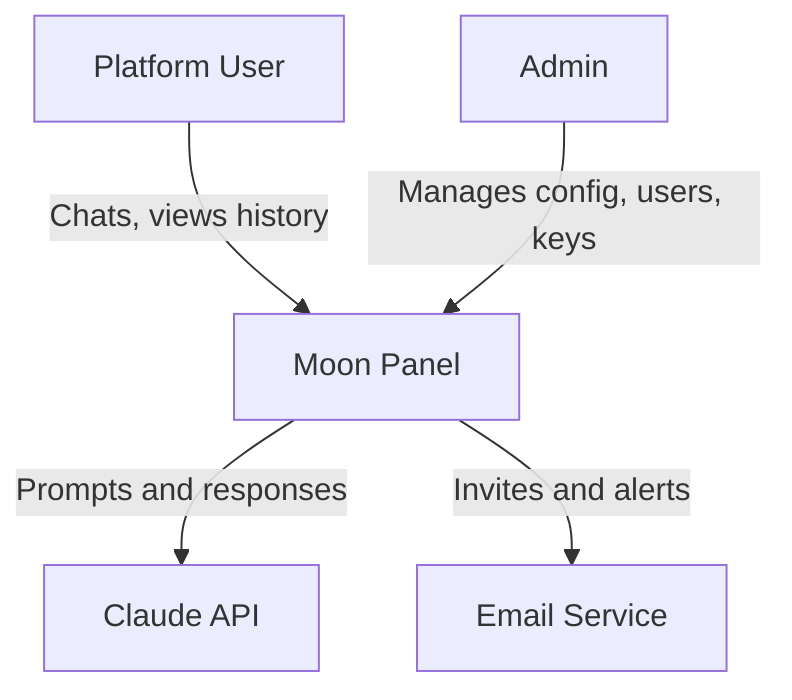
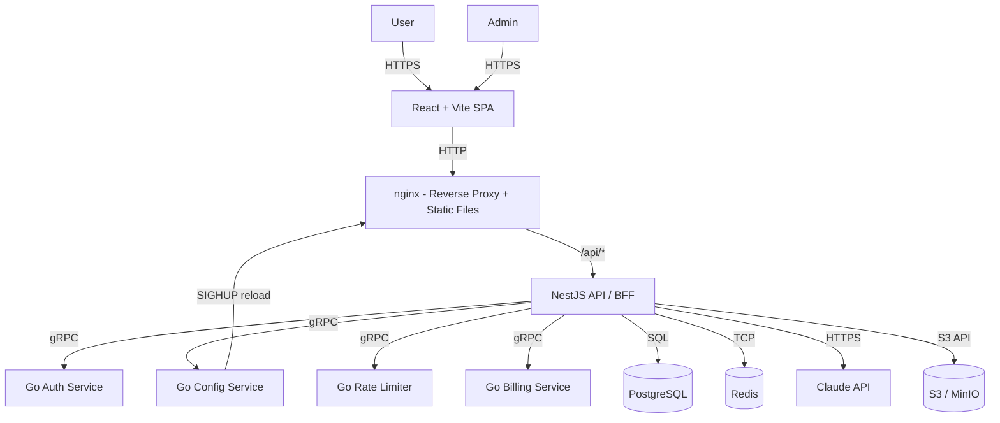
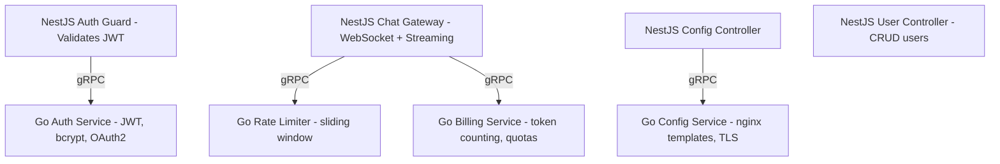
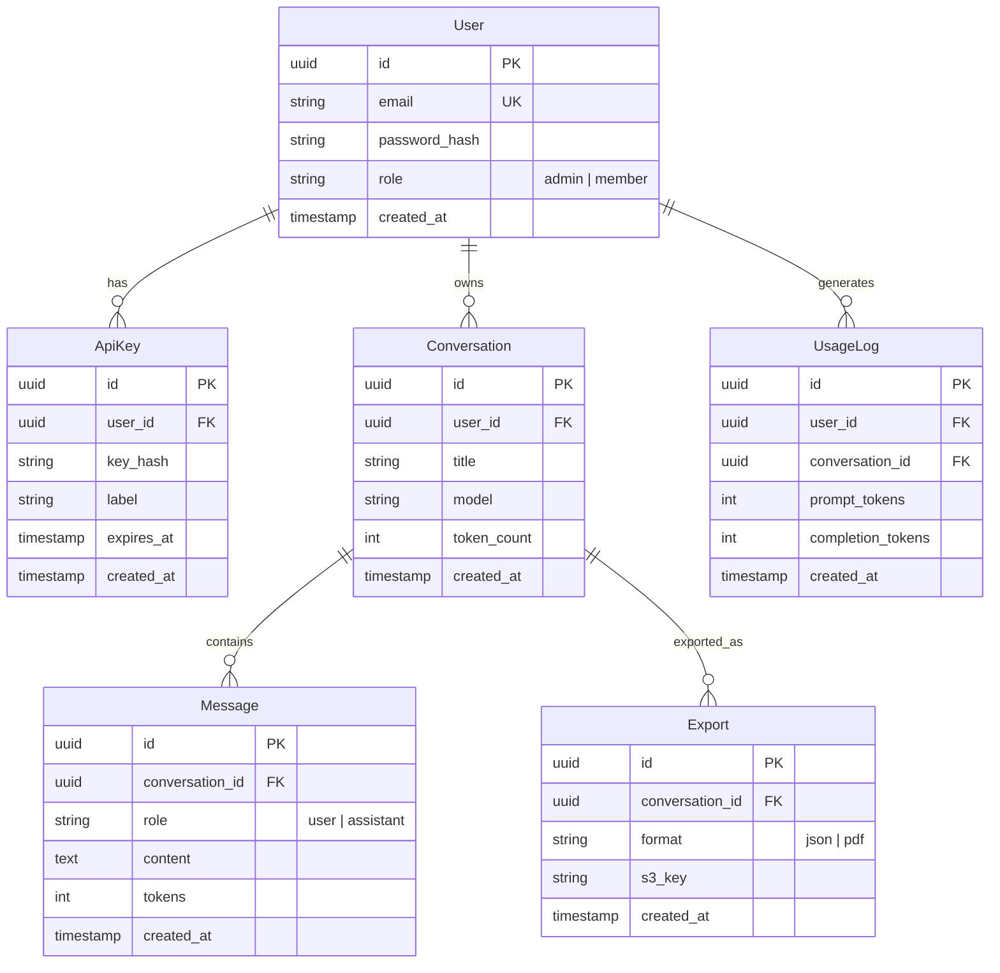
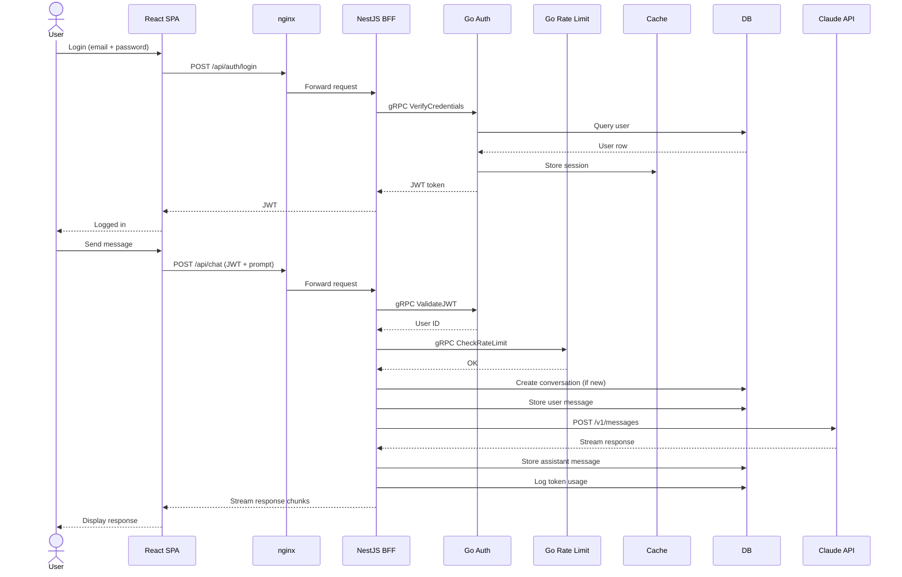
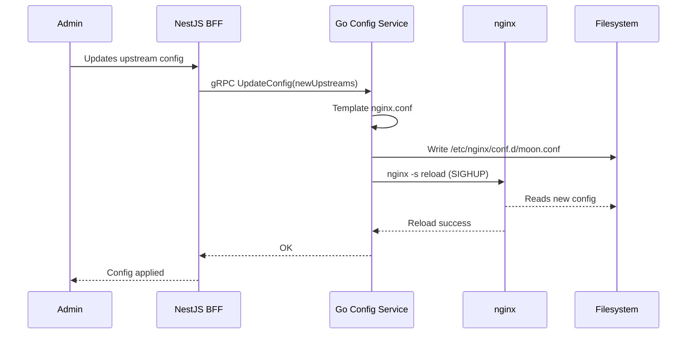

# Moon Panel — Project Plan

## Planning Methodology: C4 Model

Top engineers use the **C4 Model** (Context → Container → Component → Code) by Simon Brown. It's the industry standard at companies like Amazon, Netflix, and Spotify for visualizing software architecture at different zoom levels.

Why C4:
- Forces you to think about **system boundaries** first
- Scales from whiteboard doodles to deployment diagrams
- Easy to communicate with both engineers and stakeholders
- Works with Mermaid natively

---

## 1. Context Diagram (System Scope)

An **admin panel** for managing Claude AI interactions — conversations, API keys, usage stats, and user access.



---

## 2. Container Diagram (High-Level Architecture)

```
Browser
  |
  v
nginx --- serves static React build + reverse proxy
  |
  +--> /api/* --> NestJS (REST + WebSocket BFF)
  |                 |
  |                 +--> Go Auth Service
  |                 +--> Go Config Service (nginx config gen)
  |                 +--> Go Rate Limiter
  |                 +--> Go Billing Service
  |                 |
  |                 +--> PostgreSQL + Redis
```



---

## 3. Component Diagram (BFF + Go Services)



---

## 4. Stack Summary

| Layer | Technology | Role |
|-------|-----------|------|
| Frontend | React + Vite | SPA UI |
| Proxy | nginx | Static files, reverse proxy, TLS termination |
| BFF | NestJS | API gateway, orchestrates Go services |
| Microservices | Go | Auth, config gen, rate limiter, billing |
| Database | PostgreSQL | Primary store |
| Cache | Redis | Sessions, rate-limit counters |
| Object Store | S3 / MinIO | Exports, logs, backups |

**Communication:** NestJS to Go services via **gRPC** (preferred) or HTTP/REST.

---

## 5. Feature Roadmap (Basic v1)

| Layer | Feature | Priority |
|-------|---------|----------|
| Auth | Email + password login | P0 |
| Auth | JWT session management | P0 |
| Chat | Send prompt to Claude | P0 |
| Chat | Stream response to UI | P0 |
| Config | Go generates nginx upstreams | P0 |
| Chat | Conversation history | P1 |
| Users | Admin CRUD for users | P1 |
| Keys | Create and revoke API keys | P1 |
| Billing | Token usage counter | P2 |
| Export | Download conversation | P2 |

Only P0 is required for v1. P1 and P2 can ship later.

---

## 6. Data Model (Core Entities)



---

## 7. User Flow (Login + Chat)



---

## 8. Go Config Service (nginx config gen flow)



---

## Next Steps

1. Set up monorepo: /web (React), /bff (NestJS), /services (Go), /docs
2. Initialize React + Vite frontend
3. Scaffold NestJS BFF
4. Write Go auth microservice
5. Set up nginx with reverse proxy
6. Create PostgreSQL schema (5 tables above)
7. Implement auth flow (P0)
8. Implement chat flow + streaming (P0)
9. Write Go config service for nginx reloads (P0)
